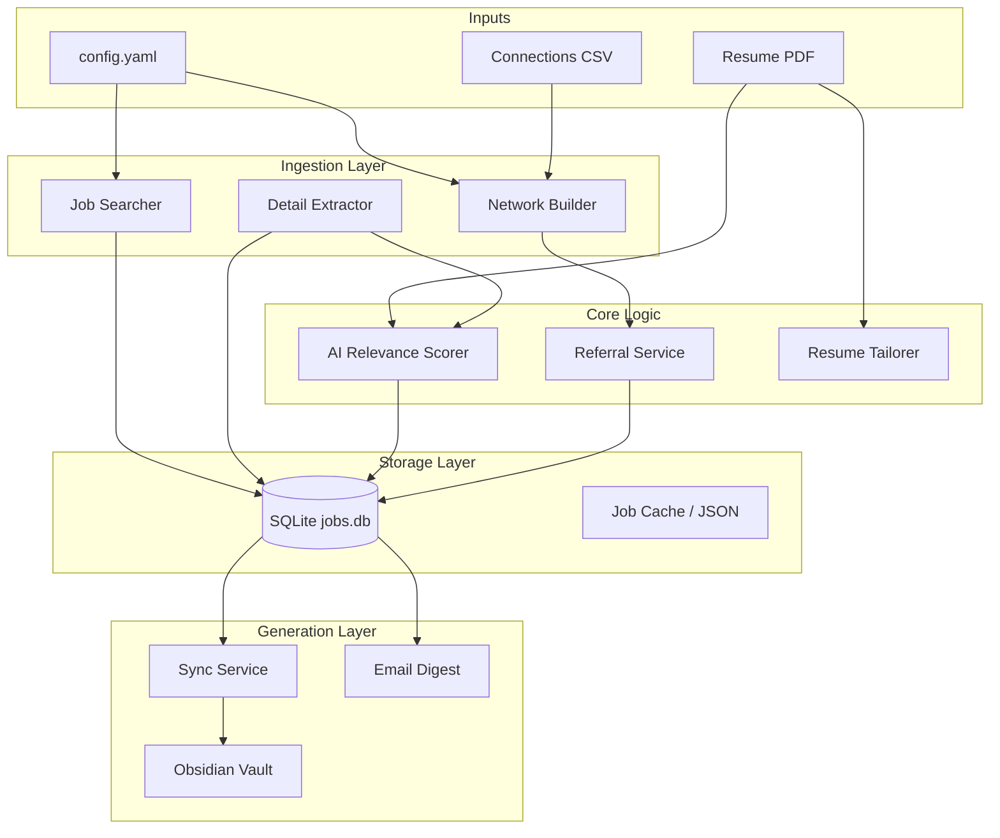

# System Architecture: Job Hunt Mind Mapper

## Overview
The architecture is designed as a standalone Python application that interacts with external job sources and generates a structured Obsidian Vault for visualization and tracking.

## Components & Data Flow

### 1. Data Ingestion Layer (`src/ingest`)
Responsible for fetching data from external sources.
- **Job Seeker Profile**: Parses user's resume (PDF/Text) or LinkedIn profile to extract skills and experience.
- **Job Listings**: Fetches relevant job postings using browser automation.
  - *Strategy*: Use `playwright` or `selenium` to automate search and extraction from the user's LinkedIn feed (as a logged-in user).
- **Network Connections**: Imports user's connections without API costs.
  - *Strategy*: Parse the user's official LinkedIn Data Export (CSV) or use browser automation.

### 2. Core Logic Layer (`src/core`)
Processes raw data and applies business logic.
- **Experience Matcher**: Compares job requirements against user profile keywords/skills.
  - *Engine*: Local NLP (spacy) or **Gemini API** (Free Tier) for semantic matching and scoring.
- **Network Graph Builder**: Maps connections to companies with open roles.
  - Identifies "high leverage" connections (people with hiring influence or in relevant departments).

### 3. Generation Layer (`src/generator`)
Produces the final output artifacts.
- **Obsidian Builder**: Creates Markdown notes and Canvas files.
- **Resume Engine**: 
  - Takes a LaTeX template (`.tex`).
  - Uses AI (Gemini) to inject tailored content for a specific job.
  - Compiles to PDF using a local LaTeX installation (`pdflatex` or `tectonic`).

### 4. Notification Layer (`src/notification`)    
Responsible for alerting the user of new opportunities.
- **Email Service**: Formats and sends HTML/Text emails using standard Python `smtplib`.
- **Digest Generator**: Compiles daily summaries of high-priority jobs.

### 5. Storage Layer (Local Filesystem)
The system uses a two-tier storage approach:
- **Relational Data**: A local `SQLite` database (`data/jobs.db`) tracks job statuses (`discovered`, `new`, `scored`), analysis results, and referral requests.
- **Knowledge Base**: The structured Obsidian Vault serves as the human-readable frontend, where each job, company, and person gets a dedicated Markdown note.

## Detailed Workflow

1.  **Configuration**: User edits `config.yaml` with search parameters (keywords, location) and paths to resume/LinkedIn export.
2.  **Run**: Execute `python main.py`.
3.  **Process**:
    - Load existing vault state (to avoid overwriting manual edits).
    - Fetch new jobs matching criteria.
    - Match jobs to resume -> Calculate Score.
    - Match jobs to companies -> Match companies to connections.
4.  **Output**:
    - Create/Update `Jobs/{JobID}.md`
    - Create/Update `Companies/{Company}.md`
    - Create/Update `People/{Person}.md`
    - Generate `Dashboard.canvas` showing high-priority jobs and connections.

## Tech Stack
- **Language**: Python 3.13+
- **Data Ingestion**: `playwright` (for stealthy LinkedIn interaction)
- **Database**: `SQLite` (persistent state and discovery cache)
- **AI Processing**: Gemini / LLM (for scoring, tailoring, and message generation)
- **Templating**: `jinja2`
- **Output**: Markdown, Obsidian Canvas
